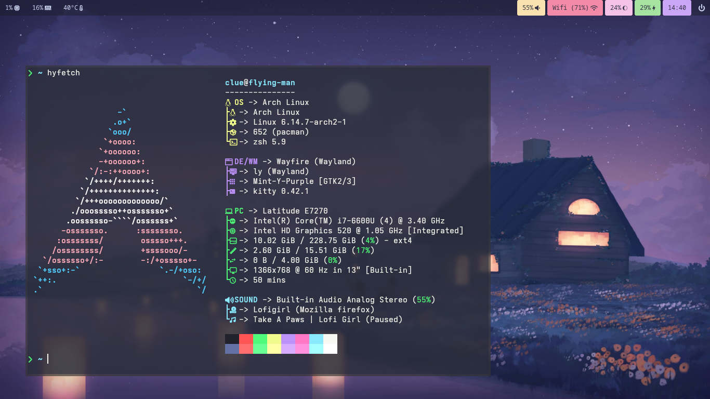
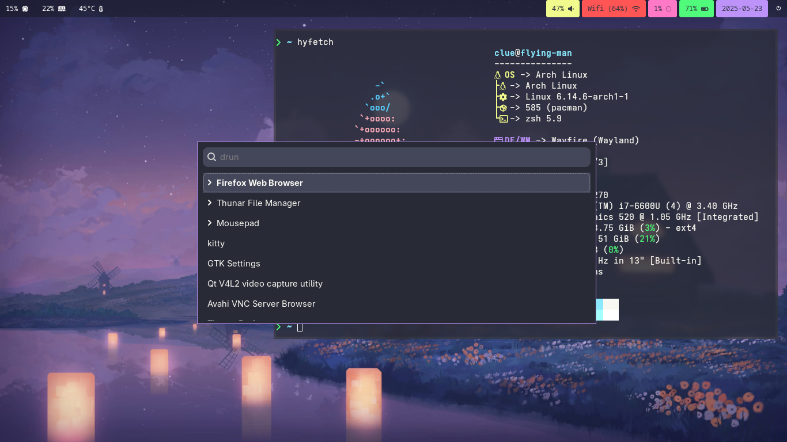

# Clue's dotfiles
This is a really messy dump of my configs. Don't expect them to be clean or to work on your machine.

- wm: wayfire
- bar: waybar
- launcher: wofi
- logout: wlogout
- lock screen: waylock
- display manager: ly
- wallpaper: swaybg
- shell: zsh (om-my-zsh)
- terminal: kitty
- redshift: wlsunset

## Screenshots

